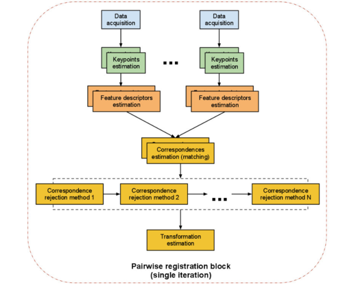
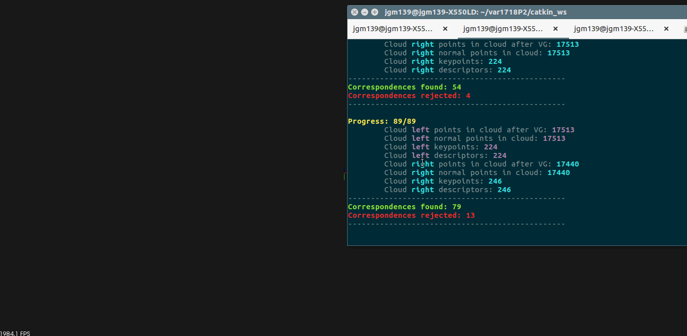

# Práctica 2 - Mapeado 3D de interiores

_Robert Esclapez García y Julia García Martínez_


### 1. Descripción de lo que se pretende hacer

En esta práctica teníamos como objetivo hacer un **mapeado 3D** del mapa propuesto. _Turtlebot_ utiliza la cámara **Kinect** para capturar nubes de puntos mientras el robot navega teleoperadamente por la vivienda.

Conforme va capturando estas nubes de puntos, el robot debe ir alineándolas de tal forma que el conjunto haga el mapeado de la casa en 3D.


### 2. Descripción de cómo se ha realizado la práctica

Conforme el robot se va moviendo por la vivienda se van realizando las capturas de tomas de datos, obteniendo conjuntos **X** = x1, x2, …, xt, donde cada _xi_ es una nube de puntos 3D tomada.

A partir de aquí, comenzando por la primera toma, extraemos las características o keypoints de _xi_ y de _xi+1_, obteniendo así los conjuntos de características **Ci** y **Ci+1**.

A continuación, extraemos los descriptores de las características obtenidas y realizamos el matching o emparejamiento de los conjuntos **Ci** y **Ci+1**.

De realizar el paso anterior, adquirimos un conjunto de correspondencias, el cual hay que filtrar porque no todas son válidas. 

Una vez aplicado el algoritmo que nos permite obtener las correspondencias correctas, obtenemos la matriz de transformación, que siempre será de la primera nube hacia la segunda.

Aplicamos la matriz de transformación a la nube inicial, alineando así la primera nube a la segunda y almacenamos el resultado. Hacemos la misma operación con el resto del conjunto de entrada.

Si en algún momento no pudiéramos alinear dos pares de nubes, procederíamos a intentar alinearla a las características globales obtenidas hasta el momento. En caso de que esto tampoco funcionara, se desharía tanto el movimiento del robot como el intento de alinear esta nueva nube.

Este sería el esquema de lo que hemos realizado:





### 3. Implementación y código desarrollado

Para la realización de la práctica hemos creado un nodo llamado `navigation`. Aquí se procesa todo el cálculo necesario para la construcción del mapeado 3D de la casa.

La navegación del robot se hace de manera teleoperada. Para desplazarnos hacia adelante usamos `w`, izquierda `a` y derecha `d`. Por último, `.` para detener el programa.


```cpp

    while(nh_.ok()){
        cmd = getchar();
        if(cmd!='w' && cmd!='a' && cmd!='d' && cmd!='.'){
            cout << "unknown command:" << cmd << "\n";
            continue;
        }
        base_cmd.linear.x = base_cmd.linear.y = base_cmd.angular.z = 0;
        switch(cmd){
            case 'w':
                base_cmd.linear.x += 0.4;
                capture = true;
                break;
            case 'a':
                base_cmd.angular.z += 0.3;
                capture = true;
                break;
            case 'd':
                base_cmd.angular.z += -0.3;
                capture = true;
                break;
            case '.':
                goto end;
                break;
        }
        ros::spinOnce();
        cmd_vel_pub_.publish(base_cmd);
    }

```


>Si en algún momento no pudiéramos alinear dos pares de nubes, procederíamos a intentar alinearla a las características globales obtenidas hasta el momento. En caso de que esto tampoco funcionara, se desharía tanto el movimiento del robot como el intento de alinear esta nueva nube.


Una vez que capturamos la primera nube (x1) hacemos:
  - Filtrado de puntos para reducir el cómputo --> `filterCloudPoint`.
  - Filtrado de puntos con SOR --> `filterSor`.
  - Obtención de las normales para, posteriormente, calcular las características --> `estimateNormals`.
  - Cálculo de los _keypoints_ --> `calculateKeyPoints`.
  - Cálculo de los descriptores de los _keypoints_ --> `calculateFeatures`.


```cpp

    *visu_pc = *msg;
			
    pcl::PointCloud<pcl::PointXYZRGB>::Ptr cloud_filtered_last (new pcl::PointCloud<pcl::PointXYZRGB>);
    filterCloudPoint(visu_pc, cloud_filtered_last);

    pcl::PointCloud<pcl::PointXYZRGB>::Ptr cloud_filtered_sor_last (new pcl::PointCloud<pcl::PointXYZRGB>);
    filterSor(cloud_filtered_last, cloud_filtered_sor_last);

    pcl::PointCloud<pcl::PointNormal>::Ptr cloud_normals_last (new pcl::PointCloud<pcl::PointNormal>);
    estimateNormals(cloud_filtered_sor_last, cloud_normals_last);

    calculateKeyPoints(cloud_filtered_sor_last, cloud_normals_last, keypoints_last);
    calculateFeatures(cloud_filtered_sor_last, keypoints_last, cloud_normals_last, fpfhs_left);

```


>A partir de aquí, cada vez que capturemos una nube de puntos realizaremos las operaciones explicadas arriba.


Una vez que tenemos tanto Ci como Ci+1 y sus correspondientes descriptores, hacemos el _matching_ de las correspondencias y las filtramos para descartar las incorrectas, obteniendo la matriz de transformación `transformation`.


```cpp

    // Buscamos las correspondencias
    matchFeatures(fpfhs_global, fpfhs_right, correspondences_global);

    // Filtramos las correspondencias
    // Obtenemos la matriz de transformación
    Eigen::Matrix4f transformation = correspondencesRejection(keypoints_global, keypoints_right, correspondences_global, correspondencesRejected_global);

```


A continuación, comprobamos mediante un umbral si las correspondencias **rechazadas** corresponden en un 80% de las correspondencias **totales**. En caso de que el if se cumpla, querrá decir que **no** hemos encontrado similitud entre las dos nubes. Por lo tanto, intentaremos alinear la segunda nube con el conjunto global.


```cpp

    if(correspondencesRejected.size() > correspondences.size()/1.25){...}
    
```


Volvemos a realizar el los cálculos hasta que obtengamos de nuevo el conjunto de correspondencias totales y rechazadas y comprobamos de nuevo mediante el umbral.

Si vuelve a cumplirse la condición, significará que tampoco se han encontrado similitudes entre la nube local y la global. Por tanto, desharíamos el movimiento del robot y la alineación de esa nube.

Si los pares de nubes, ya sean 2 locales o local con global, consiguen alinearse, procedemos almacenar el resultado globalmente:
  - Transformamos la nube global `visu_pc` aplicando la matriz de transformación.
  - Sumamos las nubes para apilarlas conjuntamente.
  - Filtramos el resultado para descartar puntos comunes.
  

```cpp

    *keypoints_last = *keypoints_right;
    *fpfhs_left = *fpfhs_right;

    pcl::PointCloud<pcl::PointXYZRGB>::Ptr transformed_cloud_global (new pcl::PointCloud<pcl::PointXYZRGB>);
    pcl::transformPointCloud(*visu_pc, *transformed_cloud_global, transformation);

    *visu_pc = *transformed_cloud_global + *cloud_filtered_right;

    pcl::PointCloud<pcl::PointXYZRGB>::Ptr filtrado_global (new pcl::PointCloud<pcl::PointXYZRGB>);
    filterCloudPoint(visu_pc, filtrado_global);
    cout << "Done Global" << endl;
    visu_pc = filtrado_global;

```


Se ha usado para:
 - filtarado --> **Voxel Grid** (_leaf size 0.25_)
 - keypoints --> **Sift**
 - descriptores --> **fpfh**
 - matching --> **CorrespondeceEstimator** 
 - detector de correspondencias falsas --> **RANSAC**


##### Parte optativa

Cuando se capturan nubes de puntos, no siempre todos los puntos son válidos. A veces hay ruido en los datos o algunos puntos, pese a ser correctos, no aportan información de forma conjunta al resto. Esto puede complicar el extraer información local, en nuestro caso, normales.

Puede llevar a casos en el que el registro de nubes falle o no sea preciso. Usando **SOR**, podemos eliminar esos puntos, comparándolo con sus vecinos más cercanos y eliminando aquellos que no cumplen un cierto criterio, en nuestro caso, la distancia.


```cpp

    void filterSor(pcl::PointCloud<pcl::PointXYZRGB>::Ptr& cloud, pcl::PointCloud<pcl::PointXYZRGB>::Ptr& cloud_filtered){

        pcl::StatisticalOutlierRemoval<pcl::PointXYZRGB> sor;
        sor.setInputCloud (cloud);
        sor.setMeanK (100); // Probar valores
        sor.setStddevMulThresh (0.25); //Probar valores
        sor.filter (*cloud_filtered);
    }

```


>Función para filtrar las nubes de puntos aplicando SOR.


```cpp

    // Filtramos los puntos
    filterCloudPoint(msgP, cloud_filtered_right);

    // Aplicamos Sor
    filterSor(cloud_filtered_right, cloud_filtered_sor_right);

    // Conseguimos las normales
    estimateNormals(cloud_filtered_sor_right, cloud_normals_right);

    // Sacamos puntos característicos
    calculateKeyPoints(cloud_filtered_sor_right, cloud_normals_right, keypoints_right);

    // Calculamos features de los keypoints		
    calculateFeatures(cloud_filtered_sor_right, keypoints_right, cloud_normals_right, fpfhs_right);

    // Buscamos las correspondencias
    matchFeatures(fpfhs_left, fpfhs_right, correspondences);

```


>Añadimos después del filtrado de puntos el filtrado por SOR para reducir el tiempo de cómputo y mejorar el resultado.


En el pto. 4 se indican los distintos parámetros que se usaron.


### 4. Nube de puntos resultado del registro

Tras la aplicación del algoritmo descrito a unas 90 nubes de puntos de la casa, obtenemos el siguiente resultado:





El tiempo de computo para este registro es de **189.61 segundos** obteniendo una nube compuesta de **122.435 puntos**.

Aplicando el algoritmo **SOR** (Statistical Outlier Removal) a las nubes capturadas, después del filtrado, obtenemos un resultado mucho más satisfactorio.


Además de obtener una mejor reconstrucción, al eliminar puntos no significantes con **SOR**, el tiempo de cálculo es significativamente menor: **169.845 segundos**. Se obtiene una cantidad de puntos menor del modelo total, **115.105**.

Hacemos uso del algoritmo **SOR**, utilizando una búsqueda de 100 puntos más cercanos y con un valor de distacia máximo de 0.25 cm.

Hemos realizado también pruebas con diferentes combinaciones de valores (_10_ y _0.25_, _100_ y  _0.25_, _100_ y _0.30_, _100_ y _0.50_, _300_ y _0.25_, _50_ y _0.25_, _50_ y _0.50_) pero los resultados obtenidos eran malos o al menos no tan buenos como los obtenidos con los parámetros finales.
